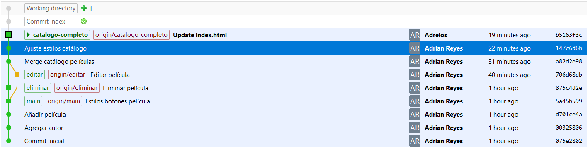

# Trabajo realizado por Adrian Reyes
* Además de Git Extensions utilicé comandos de git para hacer el trabajo

1. Una vez creado el repositorio en GitHub ejecuté el comando
    ```cmd
    git add .
    ```
    ```cmd
    git commit -m  "Commit Inicial"
    ```
2.  Agregué el autor.txt y ejecuté:
    ```cmd
    git add autor.txt
    ```
    ```cmd
    git commit -m  "Agregar autor"
    ```

3.  Añadí estilos en los botones y ejecuté:
    ```cmd
    git add styles.css
    ```
    ```cmd
    git commit -m  "Estilos botones película"
    ```
4. Creé la rama **eliminar**:
Este comando crea una rama y se mueve a ella:
    ```cmd
    git checkout -b  eliminar 
    ```
5. Añadí el contenido de Eliminar película:

    ```cmd
    git add .
    ```
    ```cmd
    git commit -m  "Eliminar película"
    ```

6. Para volver al commit anterior (Estilos botones película) primero ejecuté:
    ```cmd
    git log --oneline
    ```
    Para ver el ID de commit.
    Y luego ejecuté:
    ```cmd
    git checkout <commit_id>
    ```
    Para moverme al commit.

7. Cree la rama editar con:
    ```cmd
    git checkout -b  editar 
    ```
    y realicé los cambios:
    ```cmd
    git add .   
    ```

    ```cmd
    git commit -m  "Editar película"
    ```
    
8. Volví a la rama principal con:
    ```cmd
    git checkout main
    ```
    Y cree la rama catalogo-completo:
    ```cmd
    git checkout -b catalogo-completo
    ```

9. Realicé el merge con eliminar:
    ```cmd
    git merge eliminar
    ```

10. Realicé el merge con editar:
    ```cmd
    git merge editar
    ```
    Pero surgió el conflicto que resolví desde Visual Studio Code.
    Una vez resuelto ejecuté:
    ```cmd
    git add .   
    ```

    ```cmd
    git commit -m  "Merge catálogo películas"
    ```

11. Para subir el repositorio a GitHub ejecuté:
    ```cmd
    git push --all origin
    ```
    Para subir todas las ramas.

### Imagen del gitflow de Git Extensions
